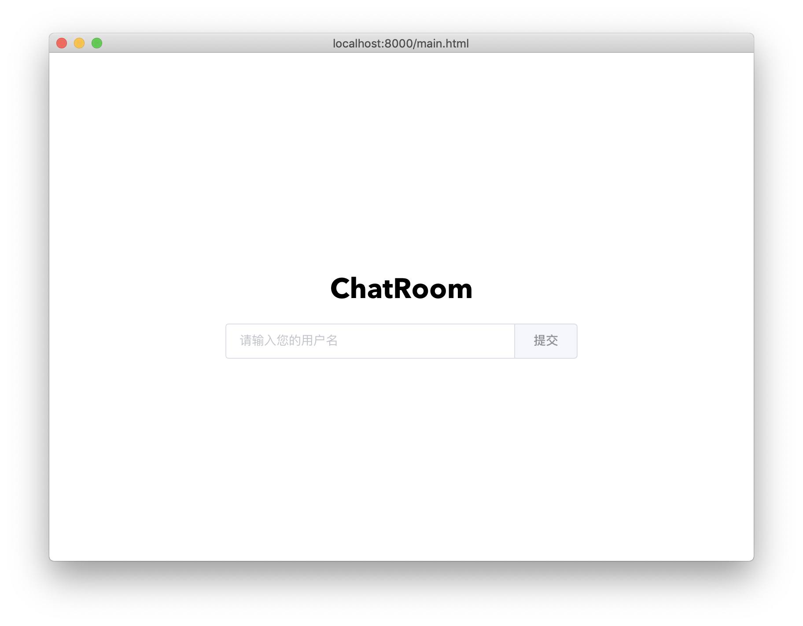
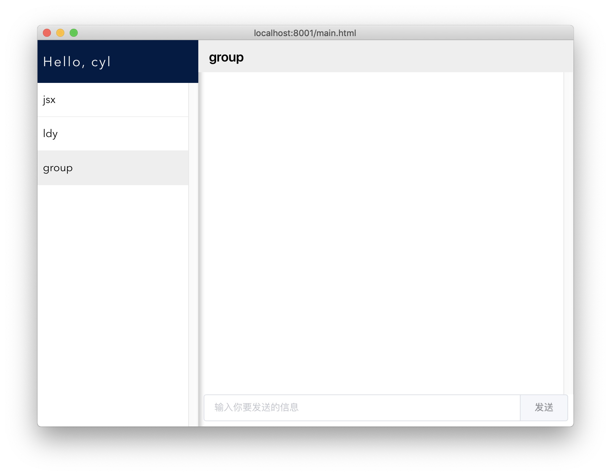
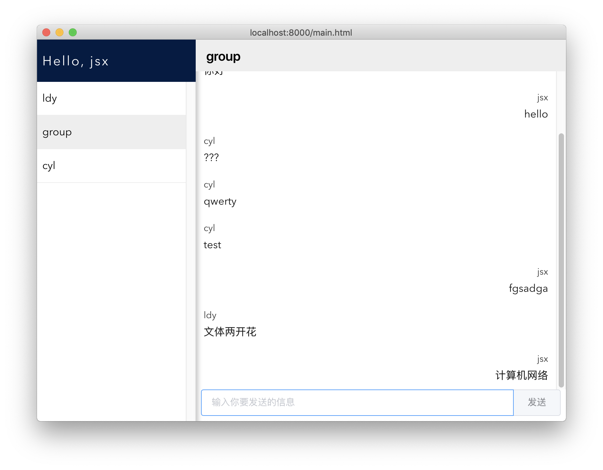
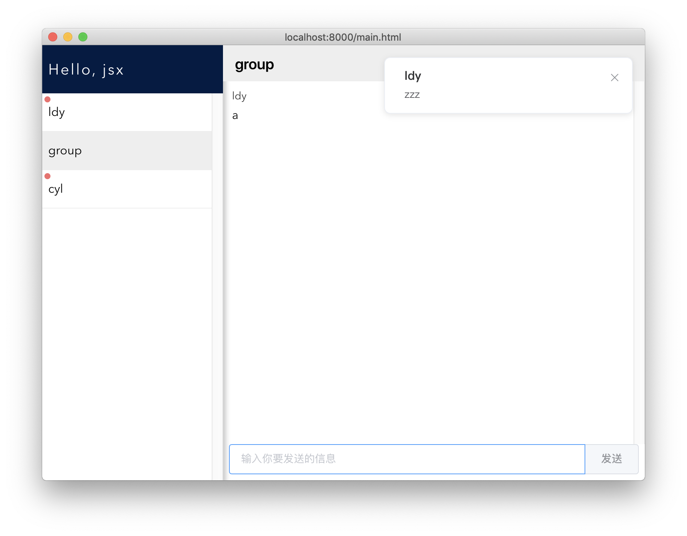

# ChatRoom

## 一. 简介

一个简易的聊天工具，登陆之后会自动刷新聊天列表，其中有一个名叫```group```的群，所有人都可以在群里聊天，同时也支持和其它用户私聊。

## 二. 开发环境

后端：python3 + socket

前端：python eel + vue.js

```shell
// 启动服务端
python3 /server/server.py
// pip3 install eel 
// 如果安装失败，请先升级pip和setuptools
// python3 -m pip install --upgrade pip
// pip3 install --upgrade setuptools
// 启动客户端
python3 /client/ui.py
```

## 三. 协议设计

#### Client:

+ 登陆 :  ```LOGIN|yourname ```  
+  获取用户列表: ```UPDATE``` 
+ 发送消息: ```CHAT|yourname|targetname|message``` ，若发送目标是群，```targetname```就是```group``` ，否则是其它用户的id

#### Server：

+ 登陆: 成功回复```OK``` , 否则回复```Failed``` 
+ 发送用户列表: ```UPDATE|namelist``` 
+ 转发消息: ```CHAT|roomname|fromname|message``` ,若发送的目标是群，```roomname``` 就是```group```,否则为其它用户的id

 ## 四. 实现

#### Server：

维护一个Server类，类的成员变量如下

```python
self.conn_dict = {} 
self.addr_dict = {'group': '0'} 
self.con_dict = {}  
self.socket = socket.socket(socket.AF_INET, socket.SOCK_STREAM)
```

+ ``` conn_dict``` : 保存所有用户的连接
+ ```addr_dict``` : 保存所有用户的地址
+ ```con_dict``` : 为每个连接设置一个socket写入锁，threading.Condition()
+ ```socket``` : 用来建立连接

首先，每个连接的第一个请求为login请求，先判断login的name是否合法(省略部分)，然后为该连接创建一个锁，然后添加该用户。最后用```self.update()``` 来刷新所有用户的列表。

```python
def login(self, name, conn, addr):
        ...
        con = threading.Condition()
        if con.acquire():
            self.con_dict[name.lower()] = [con, ]
            self.conn_dict[name.lower()] = [conn, ]
            self.addr_dict[name.lower()] = addr
            try:
                conn.sendall('OK'.encode('utf-8'))
                con.release()
            except:
                con.release()
        self.update()
```

登陆成功后，需要建立长连接，开一个线程建立长连接来监听该连接的消息。

收到连接的消息后，开一个线程给```handler``` 来处理收到的消息，```handler``` 会根据协议解析收到的信息，然后交给对应的函数处理

```python
def handler(self, data, conn, addr):
        args = data.split('|')
        if args[0] == 'LOGIN':
            self.login('|'.join(args[1:]), conn, addr)
        if args[0] == 'LOGOUT':
            self.logout('|'.join(args[1:]))
        if args[0] == 'CHAT':
            self.chat(args[1], args[2], '|'.join(args[3:]))
        if args[0] == 'UPDATE':
            self.update()
```

需要用到两个函数```chat``` 和```update``` 来处理要发送的消息和发送的对象

```python
def chat(self, name_a, name_b, msg):
        if name_b not in self.addr_dict.keys():
            pass
        if name_b.lower() == 'group':
            msg = 'CHAT|' + 'group' + '|' + name_a + '|' + msg
            for name in self.conn_dict.keys():
                if name != name_a:
                    self.send(name, msg)
        else:
            msg = 'CHAT|' + name_a + '|' + name_a + '|' + msg
            self.send(name_b, msg)
            
 def update(self):
        names = 'UPDATE|' + '|'.join(self.addr_dict.keys())
        print(names)
        for name in self.conn_dict.keys():
            self.send(name, names)           
```

这些函数处理好后交给```self.send```  函数来执行具体的socket部分

```python
def send(self, name, msg):
		...
        if con.acquire():
            try:
                conn = self.conn_dict[name][0]
                conn.sendall(msg.encode('utf-8'))
                con.release()
                return True
            except:
                print('send ' + msg.split('|')[0] + ' to ' + name + ' failed.')
                con.release()
                return False
```

先判断是否合法(省略部分)，然后给要发送的对象申请锁资源，然后发送消息，发送完后释放锁。

#### Client:

维护一个Client类，包括这个用户的id，服务器的连接和一个socket写入的锁

```python
self.name = ''
self.name_list = []
self.conn = socket.socket(socket.AF_INET, socket.SOCK_STREAM)
self.conn.connect(addr)
self.con = threading.Condition()
```

连接到服务器后，先执行```login``` 请求，然后保持长连接来监听服务器。

收到服务器的消息后交给```handler``` 来处理，与服务器的处理类似。

## 五. 界面

#### 功能：

* 登陆/退出
* 发送消息
* 接收消息
* 群聊
* 私聊
* 消息提醒
* 未读消息提醒

#### 技术栈介绍

1. `eel`：A little Python library for making simple Electron-like HTML/JS GUI apps
2. `Vue.js`: 渐进式 JavaScript 框架

通过`eel`来沟通python和javascript，使这两个语言能够传输数据，采用事件驱动的方式，在每个事件出发的时候调用相应的函数。

#### 展示

##### 登陆



##### 聊天界面



##### 群聊



##### 未读消息提示/消息提醒



## 六. 分工

1. 协议设计： 李东洋、靳帅祥
2. server部分：李东洋
3. client部分：李东洋、靳帅祥
4. 界面部分：靳帅祥


